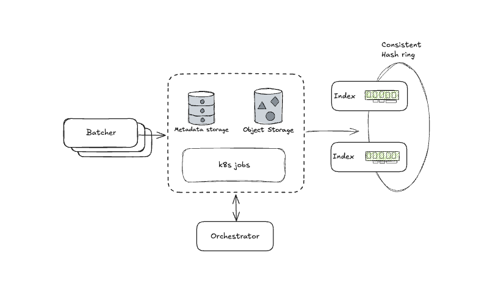

# SkyVault

SkyVault is a high-performance, scalable object-store backed key-value store designed for efficient data management and
retrieval.

### Key Components

- **Batcher**: Efficiently batch operations to write to Objectstore
- **Cache**: Fast in-memory access on the serving path
- **Index**: Handles read requests and serves them uses cache
- **Worker/Orchestrator**: Background jobs to compact/purge data in Objecstore

## Architecture

SkyVault's architecture is designed for high scalability and performance:

## Technologies Used

| Technology                                   | Description                                                   |
|----------------------------------------------|---------------------------------------------------------------|
| [Connect](https://connectrpc.com/)           | Type-safe APIs with Protobuf and gRPC                         |
| [PostgreSQL](https://www.postgresql.org/)    | Relational database (via [pgx](https://github.com/jackc/pgx)) |
| [MinIO](https://min.io/)                     | S3-compatible object storage                                  |
| [Prometheus](https://prometheus.io/)         | Monitoring and metrics                                        |
| [River](https://github.com/riverqueue/river) | Background job processing                                     |
| [Kubernetes](https://kubernetes.io/)         | Container orchestration platform                              |
| [Helm](https://helm.sh/)                     | Package manager for Kubernetes                                |
| [Podman](https://podman.io/)                 | Daemonless container engine                                   |

## Development

### Prerequisites

- Go 1.24+
- Podman, k8s and helm for local development
- [Just](https://github.com/casey/just) command runner

### Getting Started

1. Clone the repository
2. Run `just k8s-dev` to start everything in k8s
3. Run `just k8s-stress` to send some load

## Contributing

Contributions to SkyVault are welcome! Here's how you can contribute:

1. Fork the repository
2. Create a feature branch (`git checkout -b feature/amazing-feature`)
3. Commit your changes (`git commit -m 'Add some amazing feature'`)
4. Push to the branch (`git push origin feature/amazing-feature`)
5. Open a Pull Request

Please ensure your code follows the project's style guidelines and includes appropriate tests.

## Security

See our [Security Policy](SECURITY.md) for reporting security vulnerabilities.

## License

This project is licensed under the terms in the [LICENSE](LICENSE) file.
